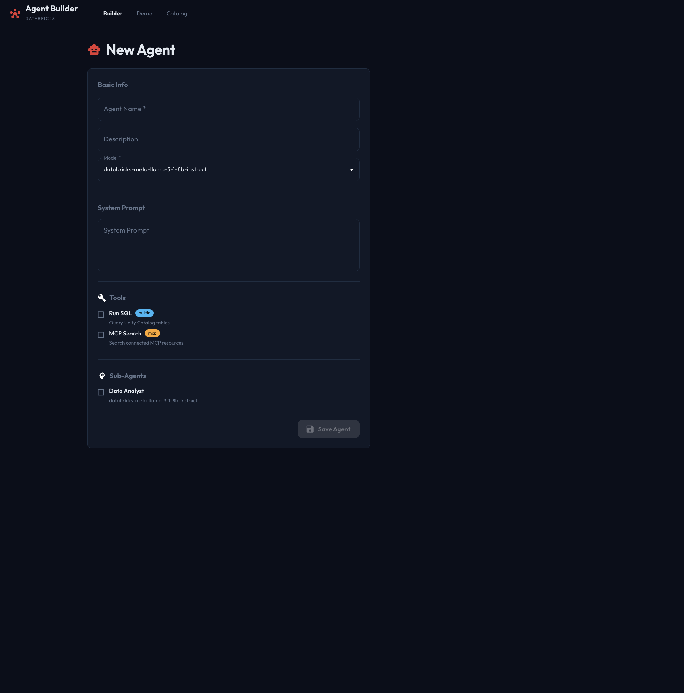

# Databricks Agent Builder

Build, configure, and run tool-using AI agents on Databricks. The app combines a FastAPI service with a Next.js interface and uses Databricks Model Serving, Unity Catalog, AI Gateway, and MLflow.



*The Builder screen, shown with representative model, tool, and sub-agent entries.*

## What it does

- Create agents with a model endpoint, system prompt, built-in or MCP tools, and other agents as sub-agents.
- Run an agent in the Demo chat and inspect its tool calls, status, and latency.
- Browse agents, enabled tools, and Unity Catalog tables in the Catalog.
- Store agent definitions and execution traces in the `agent_platform.v1` Unity Catalog schema.
- Register agent versions and log runs with MLflow.

## Architecture

| Component | Responsibility |
| --- | --- |
| `agent-builder/frontend` | Next.js 14 interface for the Builder, Demo, and Catalog. In development, `/api/*` is proxied to FastAPI on port 8000. |
| `agent-builder/backend` | FastAPI routes and LangGraph agent execution. Uses Databricks AI Gateway for model calls. |
| Unity Catalog | Stores agents, tools, and run traces in catalog `agent_platform`, schema `v1`. |
| Databricks workspace | Supplies serving endpoints, SQL Warehouse access, secret lookup for MCP tools, and MLflow tracking. |

## Requirements

- Python 3.9 or later
- Node.js and npm
- A Databricks workspace with a configured SQL Warehouse and access to the `agent_platform.v1` schema
- Permission to list and query the configured serving endpoints, and to use the `agent-platform` secret scope when configured MCP tools require credentials

## Run locally

### 1. Configure Databricks access

Authenticate the Databricks SDK using your local Databricks CLI profile or another supported SDK credential source. Create `agent-builder/backend/.env` with your profile name and SQL Warehouse HTTP path:

```dotenv
DATABRICKS_CONFIG_PROFILE=your-profile
WAREHOUSE_HTTP_PATH=/sql/1.0/warehouses/your-warehouse-id
```

`DATABRICKS_CONFIG_PROFILE` is optional when your default profile is the one to use. Keep `.env` and all credentials local; do not commit real workspace details, tokens, or secret values.

### 2. Start the API

```bash
cd agent-builder/backend
python -m venv .venv
source .venv/bin/activate
python -m pip install -r requirements.txt
python app.py
```

The API listens on `http://localhost:8000`. Interactive API documentation is available at `http://localhost:8000/docs`, and the health check is at `http://localhost:8000/health`.

### 3. Start the web interface

In a second terminal:

```bash
cd agent-builder/frontend
npm ci
npm run dev
```

Open `http://localhost:3000`. The Next.js development server forwards `/api/*` requests to the API on port 8000.

## API overview

The API is versioned under `/api/v1`:

| Route | Purpose |
| --- | --- |
| `/agents` | List, create, retrieve, update, and delete agents. |
| `/agents/{agent_id}/run` | Execute an agent and return its output and trace details. |
| `/resources/models` | List available serving endpoints. |
| `/resources/tools` | List enabled tools. |
| `/resources/tables` | List tables in the configured schema. |

## Deployment

`agent-builder/app.yaml` defines the Databricks Apps FastAPI entry point. The FastAPI service can serve frontend files from `agent-builder/backend/static` when those files exist. A production frontend build-and-copy step is not currently included in this repository, so the local Next.js development workflow above is the ready-to-run UI path.

## Security notes

- Do not commit `.env` files, Databricks tokens, private keys, MCP credentials, or local CLI configuration.
- MCP credentials are resolved from the Databricks `agent-platform` secret scope at runtime.
- Local-only `CLAUDE.md`, `CC-Session-Logs/`, `.mcp.json`, and the scratch `test.py` are excluded from Git.